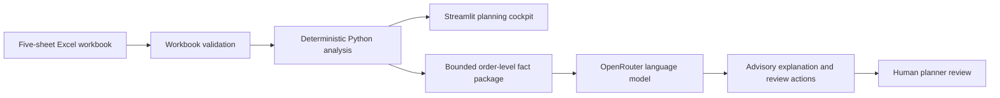

# Product Documentation

## Product purpose

The AI-Assisted Material Readiness Cockpit helps a supply chain planner identify which sales-order lines need attention, trace each risk to material and supply evidence, and prepare a human review. It is a decision-support prototype rather than an ERP replacement or an autonomous planning agent.

## Target persona

The primary user is a supply chain planner responsible for reviewing material readiness, production scheduling signals, inventory coverage, incoming purchase orders, and delivery risk. The prototype assumes that the planner understands the business context and retains responsibility for every operational decision.

## Inputs

The application accepts one Excel workbook containing five ERP-style sheets:

- `Orders`: requested products, quantities, plants, and delivery dates
- `BOM`: component requirements for each finished product
- `Inventory`: unrestricted inventory and safety stock by material, plant, and quantity unit
- `Incoming_PO`: open purchase-order schedule lines and expected receipt dates
- `Production_Orders`: production linkage, quantities, and scheduling dates

All checked-in workbooks are synthetic. The application also receives an analysis date. An OpenRouter API key is optional and is required only when the user explicitly requests an AI explanation.

## Outputs

The deterministic engine produces validated planning facts, including BOM demand, usable inventory, incoming-supply allocation, shortage quantities, exception records, priorities, production status, and order and material summaries. The Streamlit cockpit presents portfolio KPIs and drill-down evidence. For one selected order line, the optional AI Planning Copilot produces an advisory explanation, review actions, missing-information questions, limitations, and an explicit `NOT_EXECUTED` status.

## Product architecture

Python remains the source of truth for quantities, exceptions, and priorities. The language model receives only the displayed order-level payload. It cannot recalculate deterministic facts, contact suppliers, create purchase orders, reschedule production, or write data back to an ERP system.

## Target metrics and achieved results

| Metric | Target | Achieved result |
|---|---:|---:|
| Formal Oracle workbook pass rate | 25/25 | 25/25 |
| Missing or unexpected Oracle rows | 0 | 0 |
| Quantity or priority mismatches | 0 | 0 |
| Cross-plant or cross-unit allocations | 0 | 0 |
| Automated test suite | All tests pass | 288/288 |
| Formal AI calls completed | 100/100 | 100/100 |
| Unsupported recommendation rate | 0% | 0% in AI-assisted evidence review |
| Largest retained deterministic runtime | Under 3 seconds | 2.269 seconds for L08 |
| Exact cost for 100 formal calls | Record provider-reported cost | $0.35055240 |

The 162 generated actions were all rated Supported in the recorded AI-assisted evidence review. This was not an independent human-only review and is not a universal correctness claim.

## Performance tuning

The initial profile showed repeated whole-table filtering inside production-order loops and duplicate validation. The optimized implementation reuses the completed validation report, pre-converts BOM dates, builds product/plant and material/plant indexes, creates stable `(Material_ID, Plant, Quantity_Unit)` receipt pools, and advances per-pool cursors. Median runtime fell from 6.536 to 0.671 seconds for M08 and from 44.645 to 2.269 seconds for L08 while preserving deterministic allocation order.

## Data and evaluation scope

The formal deterministic dataset contains 25 reproducible synthetic workbooks. The LLM evaluation uses a fixed-seed stratified sample of 100 order-level fact packages from 2,673 eligible orders. The evaluation demonstrates evidence alignment and technical consistency within this test scope. It does not establish planner usability, effectiveness with live ERP data, or universal real-world accuracy.

## Current limitations

The prototype has no live SAP connection, ERP write-back, authentication, database, persistent workflow, multi-tenancy, automatic purchasing, automatic rescheduling, or autonomous agent workflow. Workbook input represents a planning snapshot. Related supplier PO records provide context but do not prove direct order allocation or pegging.

## Future path

The next priorities are a planner usability study, read-only ERP integration, and persistent review status. These steps should be evaluated before considering any operational automation.
